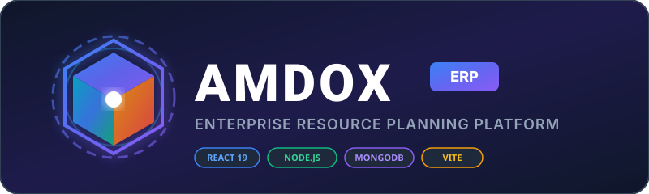

<p align="center">
  
</p>

<p align="center">
  <strong>Next-Generation Enterprise Resource Planning Platform</strong>
</p>

<p align="center">
  <a href="https://project-amdox.vercel.app"></a>
  <a href="https://react.dev"></a>
  <a href="https://nodejs.org"></a>
  <a href="https://mongodb.com"></a>
  <a href="https://tailwindcss.com"></a>
  <a href="LICENSE"></a>
</p>

---

## 🌟 Executive Overview

**AMDOX ERP** is a modern, high-performance Enterprise Resource Planning platform engineered to streamline mission-critical business operations across human resources, workforce attendance, payroll processing, supply chain inventory, sales CRM pipelines, and general ledger financial reporting.

Designed with a **glassmorphism dark/light aesthetic**, real-time data sync, and multi-tenant Role-Based Access Control (RBAC), AMDOX ERP empowers organizations with end-to-end visibility and operational efficiency.

---

## 🚀 Key Feature Modules

### ⏱️ Time & Attendance Portal
* **Device Local Time Sync**: Automatically captures exact clock-in/out timestamps and IANA timezones directly from the employee's laptop device for multi-region support.
* **15-Minute Grace Period Policy**:
  * **Shift Start**: `9:00 AM`
  * **Grace Period Cutoff**: `9:15 AM`
  * **Automatic Status Marking**: Clocking in on or before 9:15 AM marks the employee as **`Present` (On Time)**. Clocking in after 9:15 AM automatically classifies the record as **`Late` (Late Arrival)**.
* **Minute-to-Minute Duration Formatting**: Work hours are computed and registered in exact human-readable durations (e.g. `15 mins`, `2 hours`, `2 hours 15 mins`, `8 hours 30 mins`).
* **Overtime Engine**: Shifts exceeding the standard 8-hour duration automatically calculate overtime in exact hours & minutes.
* **Manual HR Logging**: Administrators and HR Managers can manually log or edit employee attendance records via an interactive modal interface.

### 👥 Human Resource Management (HRM)
* **Employee Master Directory**: Complete staff profiles detailing employee IDs, job titles, department assignments, joining dates, contact info, and base salaries.
* **Account Lifecycle Management**: Supports inline profile editing, role assignment (Admin, HR, Manager, Employee), and status toggles (Active, On Leave, Inactive, Deactivated).
* **Profile Image Uploads**: Integrated profile picture uploader with automatic image optimization and deletion triggers.

### 📅 Interactive Leave Management
* **Employee Leave Requests**: Seamless leave application interface supporting Casual, Sick, Earned, and Unpaid leave types.
* **HR Leave Handler**: Comprehensive dashboard for HR Managers to inspect pending requests, review leave balances, and approve or reject applications in real time.
* **Visual Leave Calendar**: Color-coded calendar views displaying team availability and scheduled time-off.

### 💰 Automated Payroll System
* **Monthly Salary Calculations**: Generates payroll slips with auto-computed basic salary, 5% allowances, and 2% statutory tax deductions.
* **Paystub Generation**: Individual downloadable paystub receipts and company-wide payroll status tracking (`pending`, `paid`).

### 💼 CRM & Sales Pipeline
* **Kanban Deal Board**: Visual deal management tracking leads through stages: *Lead -> Contacted -> Proposal Sent -> Negotiation -> Won -> Lost*.
* **Revenue Forecasting**: Real-time sales metrics and deal value aggregation.

### 📦 Inventory & Purchase Orders
* **Stock Control**: SKU management, stock level monitoring, and low-inventory reorder alerts.
* **Purchase Order Lifecycle**: Workflow from PO creation -> Approval -> Vendor Billing -> Goods Receipt.
* **Vendor Directory**: Supplier tracking, contract history, and accounts payable sync.

### 📓 Financial Ledger & Reporting
* **Double-Entry Accounting Validator**: Strict verification ensuring total debits equal total credits before saving transactions to MongoDB.
* **Financial Statements**: Automated Profit & Loss reports, Balance Sheets, and Cash Flow statements.

### 📧 Branded Professional Email System
* **Nodemailer Integration**: Corporate email notifications sent with embedded AMDOX branding logos, clean typography, responsive layouts, and actionable buttons.

---

## 🛠️ Technology Stack

| Layer | Technologies & Tools |
| :--- | :--- |
| **Frontend Framework** | React 19, Vite 6, React Router DOM v7 |
| **State Management** | Zustand (Global Session & Auth state) |
| **Styling & Icons** | Tailwind CSS v4, Lucide React, React Icons, Canvas Confetti |
| **Backend Runtime** | Node.js (v18+), Express.js |
| **Database & ODM** | MongoDB Atlas, Mongoose ODM |
| **Authentication** | JSON Web Tokens (JWT), HTTP-Only Cookie Sessions, BcryptJS |
| **Email Transport** | Nodemailer (SMTP Service) |

---

## 🏗️ System Architecture

```
                       +----------------------------------+
                       |      React 19 SPA (Vite)         |
                       |  Zustand Store & Tailwind CSS    |
                       +----------------------------------+
                                        |
                                 HTTPS  |  REST API / JWT
                                        v
                       +----------------------------------+
                       |     Node.js + Express Server     |
                       +----------------------------------+
                                        |
                    +-------------------+-------------------+
                    |                   |                   |
                    v                   v                   v
           +------------------+ +---------------+ +------------------+
           | Auth & RBAC      | | Controllers   | | Nodemailer       |
           | JWT Verification | | HR, Attendance| | Branded Emails   |
           +------------------+ +---------------+ +------------------+
                                        |
                                        v
                               +-----------------+
                               |  Mongoose ODM   |
                               +-----------------+
                                        |
                                        v
                               +-----------------+
                               |  MongoDB Atlas  |
                               +-----------------+
```

---

## 📁 Repository Directory Structure

```
The-Ultimate-Jarir/project-Amdox/
├── backend/
│   ├── app.js                   # Express App configuration & middlewares
│   ├── server.js                # Database connection & HTTP server launcher
│   └── src/
│       ├── config/              # MongoDB & Mailer configurations
│       ├── controllers/         # API controllers (attendance, hr, finance...)
│       ├── middlewares/         # JWT verification & RBAC authorization
│       ├── models/              # Mongoose database schemas
│       ├── routes/              # Express API endpoint routes
│       └── services/            # Nodemailer HTML email templates
├── docs/
│   └── amdox-logo.svg           # Professional animated SVG logo asset
└── frontend/
    ├── index.html               # SPA HTML entry point
    ├── vite.config.js           # Vite bundle configuration
    └── src/
        ├── App.jsx              # Application root component
        ├── components/          # Reusable UI components (Navbar, Modals, Headers)
        ├── layouts/             # RoleLayout wrapper for RBAC views
        ├── lib/                 # Axios instance & utility helpers
        ├── pages/               # Route pages (Admin, HR, Manager, Employee views)
        ├── routes/              # AppRoutes lazy route declarations
        └── stores/              # Zustand global state stores (useAuthStore.js)
```

---

## 🌐 API Endpoint Reference

### 🔑 Authentication & User Profile
| Method | Endpoint | Description |
| :--- | :--- | :--- |
| `POST` | `/api/auth/login` | Authenticate credentials & return JWT session token |
| `POST` | `/api/auth/register` | Register a new user account |
| `POST` | `/api/auth/logout` | Clear session cookies & terminate session |
| `GET` | `/api/auth/me` | Fetch active user profile & permissions |
| `PUT` | `/api/auth/profile` | Update profile information & email address |
| `POST` | `/api/auth/profile-image` | Upload profile avatar picture |
| `POST` | `/api/auth/change-password` | Change account password |

### ⏱️ Attendance Management
| Method | Endpoint | Description |
| :--- | :--- | :--- |
| `GET` | `/api/attendance` | Retrieve daily attendance logs (Filterable by date & department) |
| `GET` | `/api/attendance/status` | Check active clock-in status for current user |
| `POST` | `/api/attendance/clock-in` | Punch In with laptop local time (Auto-applies 9:15 AM Late rule) |
| `POST` | `/api/attendance/clock-out` | Punch Out & compute exact duration & overtime |
| `POST` | `/api/attendance/mark` | Manually mark attendance (HR/Admin only) |

### 👥 HR & Leave Operations
| Method | Endpoint | Description |
| :--- | :--- | :--- |
| `GET` | `/api/employees` | List all staff employee records |
| `POST` | `/api/hr/employees` | Create employee account & dispatch welcome email |
| `GET` | `/api/hr/leaves` | List all employee leave applications |
| `PATCH`| `/api/hr/leaves/:id` | Approve or reject an employee leave request |

---

## 🔧 Installation & Local Setup

### Prerequisites
* **Node.js** (v18.0.0 or higher)
* **npm** (v9.0.0 or higher)
* **MongoDB** (Local instance or MongoDB Atlas Connection String)

### 1. Environment Setup

#### Backend `.env` (`backend/.env`):
```env
PORT=8081
MONGO_URL=mongodb://127.0.0.1:27017/amdox_erp
JWT_SECRET=your_super_secret_jwt_key_999
CLIENT_URL=http://localhost:5173

# SMTP Email Configuration (Nodemailer)
SMTP_HOST=smtp.gmail.com
SMTP_PORT=465
SMTP_USER=your_email@gmail.com
SMTP_PASS=your_app_password
```

#### Frontend `.env.local` (`frontend/.env.local`):
```env
VITE_API_URL=http://localhost:8081/api
```

### 2. Install Dependencies

```bash
# Install backend dependencies
cd backend
npm install

# Install frontend dependencies
cd ../frontend
npm install
```

### 3. Run Locally

```bash
# Start backend API server (Terminal 1)
cd backend
npm run dev

# Start frontend Vite development server (Terminal 2)
cd frontend
npm run dev
```

Open your browser and navigate to `http://localhost:5173`.

---

## ⚡ Production Deployment

### Frontend (Vercel)
The React frontend compiles with Vite:
```bash
cd frontend
npm run build
```
Live URL: [https://project-amdox.vercel.app](https://project-amdox.vercel.app)

---

## 📜 License

Distributed under the **MIT License**. See `LICENSE` for more information.

<p align="center">
  Built with ❤️ for Modern Enterprise Excellence by the AMDOX ERP Team.
</p>
