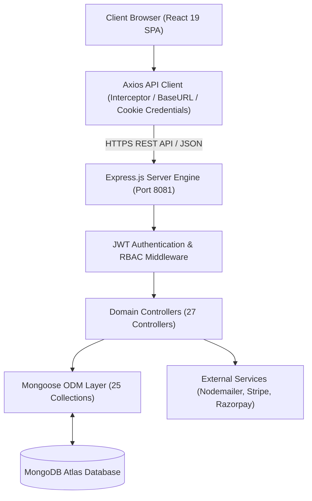

# AMDOX ERP System Architecture & Technical Documentation

This document provides a comprehensive technical reference for the **AMDOX Enterprise Resource Planning (ERP)** platform, covering system components, data schemas, authentication controls, API request lifecycles, and security specifications.

---

## 1. Project Overview

AMDOX ERP is a next-generation enterprise application designed to consolidate human resource management, workforce timekeeping, automated payroll, financial general ledger accounting, accounts receivable/payable, supply chain inventory, vendor relations, sales CRM pipelines, and AI-driven forecasting into a unified, high-performance platform.

The system features a **glassmorphism user interface**, dark/light mode synchronization, real-time device timezone synchronization, and dynamic Role-Based Access Control (RBAC) across four operational roles (Admin, HR Manager, Department Manager, Staff Employee).

---

## 2. Technology Stack

### Frontend Architecture
* **Framework**: React 19 Single Page Application (SPA)
* **Build Tool & Bundler**: Vite 6
* **Routing**: React Router DOM v7 (Lazy-loaded role layouts)
* **State Management**: Zustand (Persistent Session & Auth Store)
* **Styling & Aesthetics**: Tailwind CSS v4, Lucide React, React Icons, Canvas Confetti

### Backend Architecture
* **Runtime**: Node.js (v18+)
* **Application Framework**: Express.js
* **File Upload Processing**: Multer (Disk storage engine)
* **Security & Tokens**: JSON Web Tokens (jsonwebtoken), BcryptJS, CORS, HTTP-Only Cookie Parser

### Database & Persistence
* **Database Engine**: MongoDB Atlas Cluster
* **Object Data Modeling (ODM)**: Mongoose ODM (25 Schema Definitions)

### Third-Party Services
* **Email Transport**: Nodemailer SMTP Service (Gmail Port 465)
* **Payment Gateways**: Stripe Checkout API, Razorpay QR/UPI/Card Gateway API

---

## 3. System Architecture

The application is structured into decoupled, single-responsibility layers:



Refer to the detailed diagram: [System Architecture Diagram](diagrams/system-architecture.md).

---

## 4. Module Architecture

AMDOX ERP is organized into seven operational modules:

1. **Authentication & Security Portal**: User login, role account creation, OTP email verification, profile image uploads, password updates, and system audit trails.
2. **Human Capital Management (HCM)**: Employee directory, department structures, attendance clocking with 9:15 AM grace cutoffs, leave requests, shift rosters, and holidays.
3. **Automated Payroll**: Auto-computed basic salaries, 5% allowances, 2% tax deductions, disbursement status tracking, and PDF paystubs.
4. **Financial Ledger & Accounts**: Double-entry journal entries (Debits = Credits), customer invoicing (AR), vendor billing (AP), financial statements (P&L, Balance Sheet), and payment gateways.
5. **Supply Chain & Inventory**: Stock control, low-inventory alerts, vendor management, purchase order workflows, and asset depreciation tracking.
6. **CRM & Project Operations**: Kanban sales deal board, project budgeting, task priority tracking, and shared document repository.
7. **AI Intelligence**: Moving-average revenue forecasting, expense risk predictions, and executive KPI dashboards.

Refer to the detailed diagram: [Module Architecture Diagram](diagrams/module-architecture.md).

---

## 5. Database Architecture

The application uses **25 MongoDB collections** defined via Mongoose ODM schemas:

1. `User` - User accounts, credentials, status, and OTP fields.
2. `Employee` - Staff metadata, job designations, salary, and references to User and Department.
3. `Department` - Company departments and department heads.
4. `Attendance` - Daily check-in/out timestamps, hours worked, and status (`present`, `late`, `remote`, `absent`, `half_day`).
5. `Leave` - Time-off requests, leave types, date ranges, and approval status.
6. `Payroll` - Monthly salary processing, basic pay, allowances, deductions, and payment status.
7. `Task` - Action items, priority, due dates, project association, and assigned users.
8. `Project` - Strategic projects, timelines, assigned members, budget, and progress.
9. `Invoice` - Customer billing invoices, itemized entries, tax rates, and total amounts.
10. `Transaction` - Payment records from Stripe and Razorpay, payment methods, and receipt URLs.
11. `Vendor` - Supplier master data, payment terms, tax IDs, and credit limits.
12. `PurchaseOrder` - Procurement orders, expected delivery dates, line items, and PO status.
13. `VendorInvoice` - Accounts payable invoices linked to vendors and PO numbers.
14. `Inventory` - Stock items, SKUs, categories, unit prices, and inventory alerts.
15. `Lead` - Sales opportunities, Kanban pipeline stages, deal values, and follow-ups.
16. `JournalEntry` - Double-entry ledger postings with debits and credits.
17. `Candidate` - Recruitment applicants, interview dates/times, and hiring status.
18. `Performance` - Employee KPI evaluations, feedback, goals, and performance ratings.
19. `Training` - Corporate learning programs, instructors, date ranges, and enrolled attendees.
20. `Asset` - Enterprise equipment, categories, purchase values, assigned users, and depreciation rates.
21. `Document` - Shared files, categories, versions, and uploader references.
22. `AuditLog` - Activity log of system actions, target resources, and IP addresses.
23. `Notification` - User alert notifications and read status.
24. `Shift` - Employee work shift schedules and start/end times.
25. `Holiday` - Official company, regional, and national holidays.

Refer to the complete ER diagram: [Database ER Diagram](diagrams/database-erd.md).

---

## 6. Authentication & Authorization

### Authentication Mechanism
- **JWT Authentication**: Signed using `JWT_SECRET` with a 7-day expiration (`expiresIn: '7d'`).
- **Token Delivery**: Transmitted via HTTP-Only `token` cookies and fallback `Authorization: Bearer <token>` HTTP headers.
- **Password Security**: Passwords are hashed using `bcryptjs` with 10 salt rounds (`genSalt(10)`) during Mongoose `pre('save')` hooks.

### Authorization (RBAC)
Four role levels are recognized by backend authorization middleware:
- **`isAdmin`**: Grants full access to all endpoints, system settings, user account creation, and financial ledgers.
- **`isHR`**: Grants access to employee records, attendance management, leave approvals, payroll, recruitment, and training.
- **`isManager`**: Grants access to department team management, task assignments, project planning, and performance appraisals.
- **`isEmployee`**: Grants access to self-service portals, clock-in/out, leave submissions, personal paystubs, and assigned tasks.

Refer to the detailed diagrams:
- [Authentication Flow Diagram](diagrams/authentication-flow.md)
- [RBAC Architecture Diagram](diagrams/rbac.md)

---

## 7. API Architecture

All endpoints follow RESTful HTTP standards and return consistent JSON response envelopes:

```json
{
  "success": true,
  "message": "Operation completed successfully.",
  "data": {},
  "errors": [],
  "timestamp": "2026-08-11T12:00:00.000Z"
}
```

### Key API Endpoint Matrix

| Domain | Route | Method | Access Level | Description |
| :--- | :--- | :---: | :---: | :--- |
| **Auth** | `/api/auth/login` | `POST` | Public | Authenticates credentials & issues JWT token |
| **Auth** | `/api/auth/profile` | `PUT` | Authenticated | Updates active user profile details |
| **Attendance** | `/api/attendance/clock-in` | `POST` | Authenticated | Punches in user with 9:15 AM grace rule & local device time |
| **Attendance** | `/api/attendance/clock-out` | `POST` | Authenticated | Punches out user & computes exact work duration & overtime |
| **Leaves** | `/api/hr/leaves` | `GET` | HR / Admin | Lists all team leave applications |
| **Leaves** | `/api/hr/leaves/:id` | `PATCH` | HR / Admin | Approves or rejects an employee leave request |
| **Payroll** | `/api/payroll/calculate` | `POST` | HR / Admin | Auto-computes monthly salary slips & tax deductions |
| **Payments** | `/api/payment/create-intent` | `POST` | Authenticated | Generates Stripe / Razorpay payment intent |
| **Payments** | `/api/payment/verify` | `POST` | Authenticated | Verifies payment & marks linked invoice as Paid |

Refer to detailed request flows: [API Flow Diagrams](diagrams/api-flow.md).

---

## 8. Major Business Workflows

Detailed workflow specifications are provided in [Business Workflows Document](diagrams/business-workflows.md):

1. **Time & Attendance Policy**:
   - Standard Shift Start: **9:00 AM**
   - Grace Period Cutoff: **9:15 AM**
   - Punch-ins after 9:15 AM are automatically marked as **`late`**.
   - Work durations are formatted in exact human-readable minutes and hours (e.g. `15 mins`, `2 hours`, `2 hours 15 mins`).
2. **Leave Request & Approval**:
   - Employees submit leave requests -> HR/Admin receives instant notification -> Reviews on HR Leave Handler -> Approves/Rejects -> System dispatches branded email alert to employee.
3. **Automated Payroll**:
   - Monthly salary slips auto-compute basic pay + 5% allowances - 2% taxes -> Slips saved as pending -> Disbursed by HR -> Paystubs made available for download.
4. **Procurement & Vendor Billing**:
   - Purchase Order created (Pending) -> Approved -> Goods Received -> Vendor Invoice generated (Billed) -> Settled via Accounts Payable.

---

## 9. External Integrations

1. **Nodemailer SMTP Email Transport**:
   - Host: `smtp.gmail.com` (Port 465, SSL)
   - Dispatches branded HTML emails for OTP verification, welcome credentials, leave approvals, and system alerts.
2. **Stripe Payment Gateway**:
   - Global card payment processing, client intent creation, and instant verification.
3. **Razorpay Payment Gateway**:
   - India payment processing supporting Scan & Pay QR codes, UPI VPAs, NetBanking across 50+ banks, and RuPay cards.

---

## 10. Security Architecture

The platform incorporates multi-layered security controls:

- **Authentication**: JWT token verification on all protected endpoints.
- **Authorization**: Granular RBAC middleware enforcing role boundaries.
- **Data Hashing**: BcryptJS password hashing with salt rounds.
- **File Upload Security**: Multer restrictions on upload file types and destination directories.
- **CORS Control**: Access-Control-Allow-Origin restricted to frontend client domain with credential support.
- **Double-Entry Validation**: General Ledger transactions strictly validate that Total Debits equal Total Credits prior to database insertion.
- **Audit Logging**: Sensitive system operations (user creation, profile changes, status updates) log audit entries containing user ID, action, resource, and client IP address.
