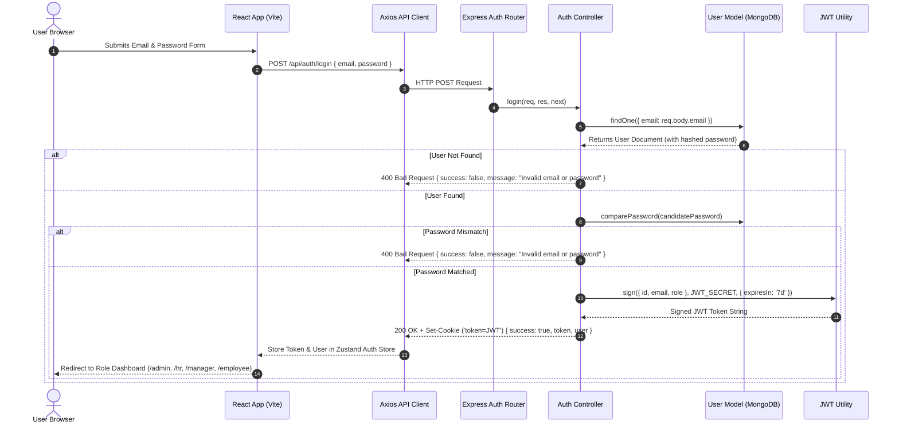
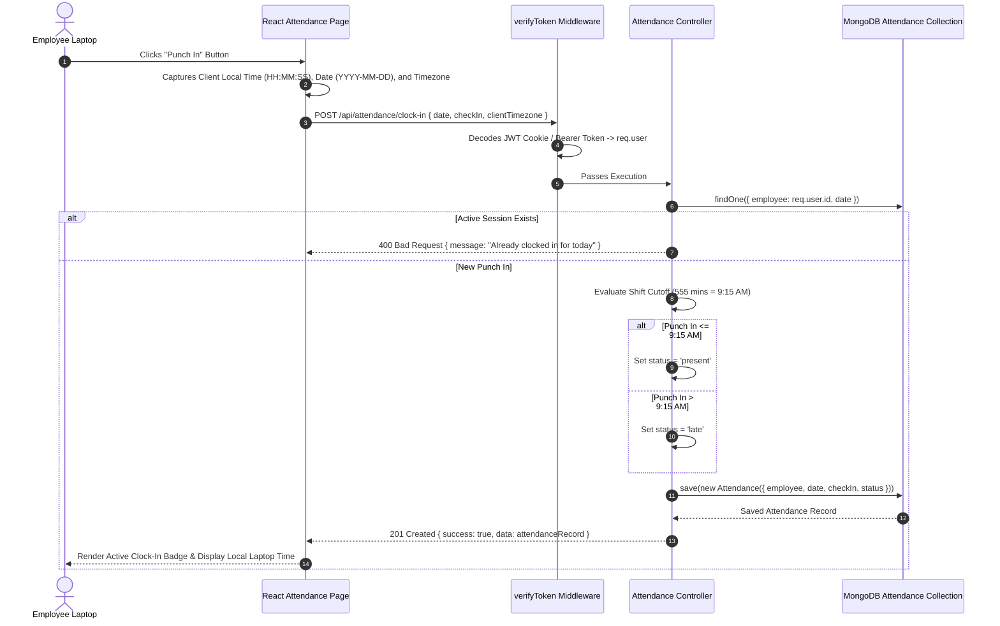
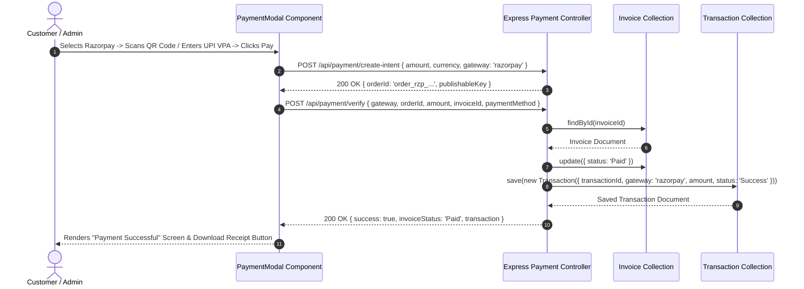

# API Request Flow & Sequence Diagrams

This document details the lifecycle of HTTP API requests as they transition through client interceptors, Express router layers, authentication middlewares, domain controllers, and Mongoose database operations.

## 1. Authentication Flow (`POST /api/auth/login`)

## 2. Attendance Clock-In Flow (`POST /api/attendance/clock-in`)

## 3. Razorpay Payment & Invoice Settlement Flow (`POST /api/payment/verify`)

