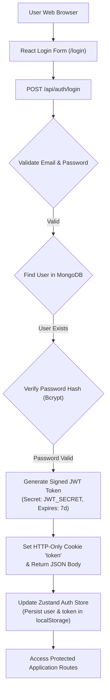
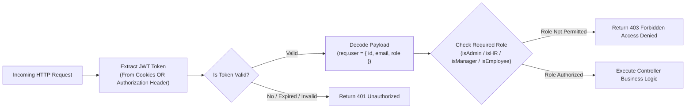
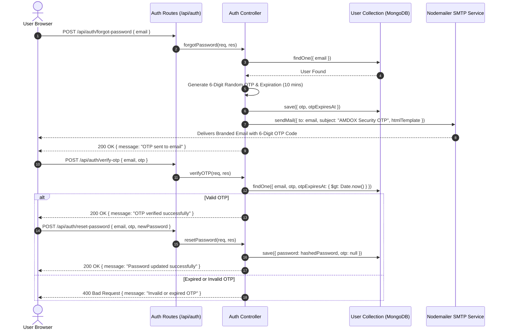

# Authentication & Authorization Architecture

This document details the security model, JSON Web Token (JWT) lifecycle, session cookie persistence, and middleware authorization checks enforced across the **AMDOX ERP Platform**.

## 1. Authentication Lifecycle

## 2. Request Authorization & Middleware Stack

## 3. Password Reset & Email OTP Verification Flow

