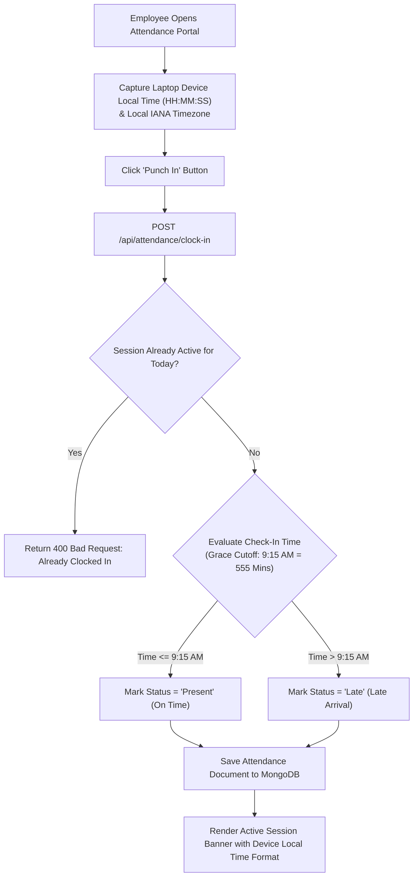
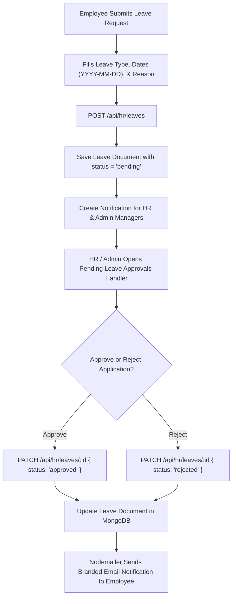
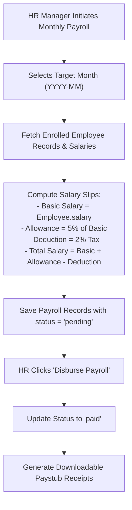
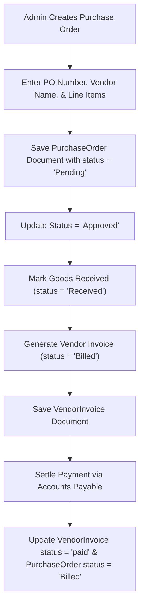

# Core Business Workflows

This document maps out the operational business workflows implemented across **AMDOX ERP**, including workforce attendance, leave management, automated payroll, purchase orders, and sales pipelines.

## 1. Attendance Punch In & Grace Period Workflow

## 2. Employee Leave Application & Approval Workflow

## 3. Payroll Calculation & Disbursement Workflow

## 4. Purchase Order & Vendor Billing Lifecycle

