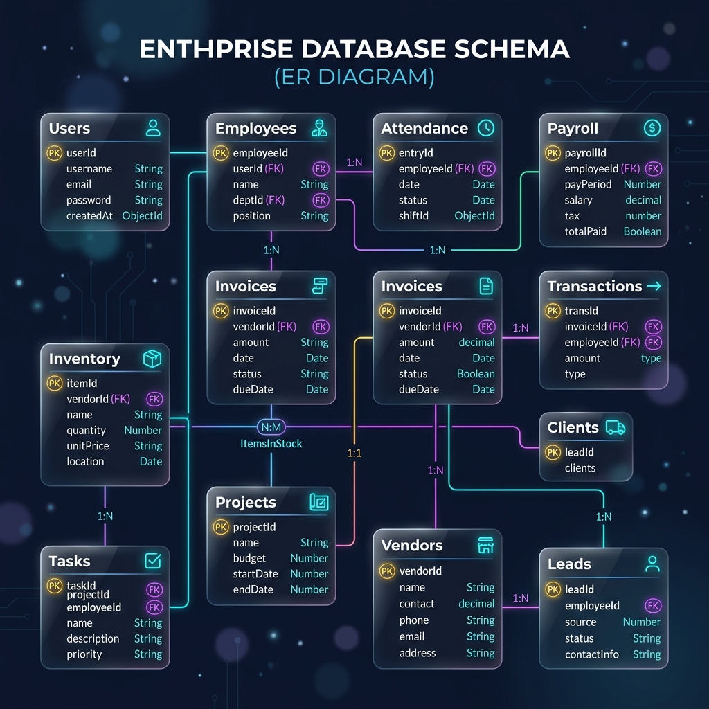

# Database Entity Relationship (ER) Diagram

This document describes the database schema architecture for the **AMDOX ERP System**. The database comprises **25 MongoDB Mongoose collections** representing workforce management, financial accounting, sales pipelines, and supply chain inventory.

## Complete Entity Relationship Diagram (25 Collections)

```mermaid
erDiagram
    User ||--o| Employee : "user (1:1)"
    User ||--o{ Attendance : "employee (1:N)"
    User ||--o{ Leave : "employee / approvedBy (1:N)"
    User ||--o{ Payroll : "employee (1:N)"
    User ||--o{ Task : "assignedTo / assignedBy (1:N)"
    User ||--o{ Project : "manager / assignedMembers (1:N)"
    User ||--o{ Department : "head (1:1)"
    User ||--o{ Lead : "assignedTo (1:N)"
    User ||--o{ Performance : "employee / evaluator (1:N)"
    User ||--o{ Training : "attendees (N:M)"
    User ||--o{ Asset : "assignedTo (1:N)"
    User ||--o{ Document : "uploadedBy / employee (1:N)"
    User ||--o{ AuditLog : "user (1:N)"
    User ||--o{ Notification : "user (1:N)"
    User ||--o{ Shift : "employee (1:N)"

    Project ||--o{ Task : "project (1:N)"
    Vendor ||--o{ VendorInvoice : "vendorId (1:N)"
    Invoice ||--o{ Transaction : "invoiceId (1:N)"

    User {
        ObjectId _id PK
        String name
        String email UK
        String password
        String role "admin | hr | manager | employee"
        String phone
        String profileImage
        String status "active | inactive | deactivated"
        Boolean isEmailVerified
        String otp
        Date otpExpiresAt
    }

    Employee {
        ObjectId _id PK
        String employeeId UK
        ObjectId user FK "Ref User"
        ObjectId department FK "Ref Department"
        String designation
        Date joiningDate
        Number salary
    }

    Department {
        ObjectId _id PK
        String departmentName UK
        String description
        ObjectId head FK "Ref User"
    }

    Attendance {
        ObjectId _id PK
        ObjectId employee FK "Ref User"
        String date "YYYY-MM-DD"
        String checkIn "HH:MM:SS"
        String checkOut "HH:MM:SS"
        Number totalHours
        String status "present | remote | late | absent | half_day"
    }

    Leave {
        ObjectId _id PK
        ObjectId employee FK "Ref User"
        String leaveType "Annual | Sick | Casual | Earned | Maternity | Paternity"
        String reason
        String startDate "YYYY-MM-DD"
        String endDate "YYYY-MM-DD"
        String status "pending | approved | rejected"
        ObjectId approvedBy FK "Ref User"
    }

    Payroll {
        ObjectId _id PK
        ObjectId employee FK "Ref User"
        String month "YYYY-MM"
        Number basicSalary
        Number allowance
        Number deduction
        Number totalSalary
        String status "pending | processing | paid"
    }

    Task {
        ObjectId _id PK
        String title
        String description
        ObjectId assignedTo FK "Ref User"
        ObjectId assignedBy FK "Ref User"
        String priority "low | medium | high"
        Date dueDate
        String status "pending | in-progress | blocked | completed"
        ObjectId project FK "Ref Project"
    }

    Project {
        ObjectId _id PK
        String title
        String description
        Date startDate
        Date endDate
        ObjectIdArray assignedMembers FK "Ref User"
        String status "Planning | Active | Completed | Blocked"
        Number progress
        Number budget
        ObjectId manager FK "Ref User"
    }

    Invoice {
        ObjectId _id PK
        String invoiceNumber UK
        String customerName
        String email
        Array items "description, qty, price"
        Number taxRate
        Number discount
        String status "Draft | Sent | Paid | Overdue | Refunded"
        String invoiceDate
        String dueDate
    }

    Transaction {
        ObjectId _id PK
        String transactionId UK
        String orderId
        String gateway "stripe | razorpay"
        Number amount
        String currency
        String status "Pending | Success | Failed | Refunded"
        String customerName
        String customerEmail
        ObjectId invoiceId FK "Ref Invoice"
        String invoiceNumber
        String paymentMethod
        String paymentIntentId
        String receiptUrl
    }

    Vendor {
        ObjectId _id PK
        String vendorId UK
        String name
        String contactPerson
        String email
        String phone
        String address
        String taxId
        String category
        String paymentTerms "net15 | net30 | net45 | net60"
        Number creditLimit
        String status "active | inactive | blocked | pending"
        Number totalOrders
        Number totalSpend
    }

    PurchaseOrder {
        ObjectId _id PK
        String poNumber UK
        String vendorName
        String email
        Array items "name, qty, price"
        String status "Pending | Approved | Received | Billed | Cancelled"
        String orderDate
        String expectedDate
    }

    VendorInvoice {
        ObjectId _id PK
        String invoiceNumber UK
        ObjectId vendorId FK "Ref Vendor"
        String vendorName
        String poNumber
        Array items "description, qty, price"
        String status "pending | approved | paid | rejected"
        String invoiceDate
        String dueDate
    }

    Inventory {
        ObjectId _id PK
        String name
        String sku UK
        String category
        Number stock
        String unit
        Number price
        String status "in-stock | low-stock | out-of-stock"
    }

    Lead {
        ObjectId _id PK
        String name
        String company
        String email
        String phone
        String stage "Lead | Contacted | Proposal Sent | Negotiation | Won | Lost"
        Number value
        ObjectId assignedTo FK "Ref User"
        String lastFollowUp
    }

    JournalEntry {
        ObjectId _id PK
        String date
        String description
        String reference
        Array transactions "account, debit, credit"
    }

    Candidate {
        ObjectId _id PK
        String name
        String email
        String phone
        String position
        String status "applied | interviewing | offered | hired | rejected"
        String resumeUrl
        String interviewDate
        String interviewTime
    }

    Performance {
        ObjectId _id PK
        ObjectId employee FK "Ref User"
        ObjectId evaluator FK "Ref User"
        String reviewPeriod
        Number kpiScore
        String feedback
        String goals
        String rating "Outstanding | Exceeds Expectations | Meets Expectations | Needs Improvement"
    }

    Training {
        ObjectId _id PK
        String title
        String description
        String instructor
        String startDate
        String endDate
        String status "scheduled | ongoing | completed"
        ObjectIdArray attendees FK "Ref User"
    }

    Asset {
        ObjectId _id PK
        String assetName
        String code UK
        String category "Hardware | Software | Furniture | Vehicles | Real Estate"
        Number purchaseValue
        String purchaseDate
        String status "Available | Assigned | Under Maintenance | Disposed"
        ObjectId assignedTo FK "Ref User"
        Number depreciationRate
    }

    Document {
        ObjectId _id PK
        String title
        String category "Contract | Identity | Certificate | Policy | Other"
        String fileUrl
        Number version
        ObjectId uploadedBy FK "Ref User"
        ObjectId employee FK "Ref User"
    }

    AuditLog {
        ObjectId _id PK
        ObjectId user FK "Ref User"
        String action
        String resource
        String details
        String ipAddress
    }

    Notification {
        ObjectId _id PK
        ObjectId user FK "Ref User"
        String title
        String message
        Boolean readStatus
    }

    Shift {
        ObjectId _id PK
        ObjectId employee FK "Ref User"
        String shiftType "Day | Night | Rotational"
        String startTime
        String endTime
        String startDate
        String endDate
    }

    Holiday {
        ObjectId _id PK
        String name
        String date UK
        String type "Company | Regional | National"
        String description
    }
```

