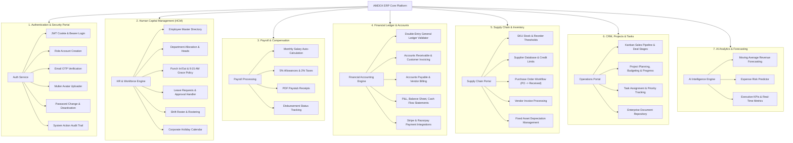

# Enterprise Module Architecture

This document maps out the operational modules of **AMDOX ERP**, detailing the sub-features, controllers, and data services encapsulated in each feature domain.

```mermaid
graph TD
    Root["AMDOX ERP Core Platform"]

    %% Module 1: Core Auth & RBAC
    subgraph ModAuth ["1. Authentication & Security Portal"]
        AuthRoot["Auth Service"]
        AuthRoot --> Login["JWT Cookie & Bearer Login"]
        AuthRoot --> Register["Role Account Creation"]
        AuthRoot --> OTPVerify["Email OTP Verification"]
        AuthRoot --> ProfileImg["Multer Avatar Uploader"]
        AuthRoot --> Security["Password Change & Deactivation"]
        AuthRoot --> AuditLogs["System Action Audit Trail"]
    end

    %% Module 2: HRM & Attendance
    subgraph ModHRM ["2. Human Capital Management (HCM)"]
        HRMRoot["HR & Workforce Engine"]
        HRMRoot --> Directory["Employee Master Directory"]
        HRMRoot --> Depts["Department Allocation & Heads"]
        HRMRoot --> Attendance["Punch In/Out & 9:15 AM Grace Policy"]
        HRMRoot --> Leaves["Leave Requests & Approval Handler"]
        HRMRoot --> Shifts["Shift Roster & Rostering"]
        HRMRoot --> Holidays["Corporate Holiday Calendar"]
    end

    %% Module 3: Payroll & Compensation
    subgraph ModPayroll ["3. Payroll & Compensation"]
        PayRoot["Payroll Processing"]
        PayRoot --> AutoCalc["Monthly Salary Auto-Calculation"]
        PayRoot --> AllowDeduct["5% Allowances & 2% Taxes"]
        PayRoot --> PaySlips["PDF Paystub Receipts"]
        PayRoot --> Disbursement["Disbursement Status Tracking"]
    end

    %% Module 4: Finance & Accounting
    subgraph ModFinance ["4. Financial Ledger & Accounts"]
        FinRoot["Financial Accounting Engine"]
        FinRoot --> Ledger["Double-Entry General Ledger Validator"]
        FinRoot --> AR["Accounts Receivable & Customer Invoicing"]
        FinRoot --> AP["Accounts Payable & Vendor Billing"]
        FinRoot --> Reports["P&L, Balance Sheet, Cash Flow Statements"]
        FinRoot --> Gateways["Stripe & Razorpay Payment Integrations"]
    end

    %% Module 5: Supply Chain & Vendors
    subgraph ModSCM ["5. Supply Chain & Inventory"]
        SCMRoot["Supply Chain Portal"]
        SCMRoot --> Inventory["SKU Stock & Reorder Thresholds"]
        SCMRoot --> Vendors["Supplier Database & Credit Limits"]
        SCMRoot --> PO["Purchase Order Workflow (PO -> Received)"]
        SCMRoot --> VendorInv["Vendor Invoice Processing"]
        SCMRoot --> Assets["Fixed Asset Depreciation Management"]
    end

    %% Module 6: CRM & Project Operations
    subgraph ModOps ["6. CRM, Projects & Tasks"]
        OpsRoot["Operations Portal"]
        OpsRoot --> CRM["Kanban Sales Pipeline & Deal Stages"]
        OpsRoot --> Projects["Project Planning, Budgeting & Progress"]
        OpsRoot --> Tasks["Task Assignment & Priority Tracking"]
        OpsRoot --> Docs["Enterprise Document Repository"]
    end

    %% Module 7: AI Intelligence
    subgraph ModAI ["7. AI Analytics & Forecasting"]
        AIRoot["AI Intelligence Engine"]
        AIRoot --> RevenuePredict["Moving Average Revenue Forecasting"]
        AIRoot --> ExpensePredict["Expense Risk Predictor"]
        AIRoot --> DashboardStats["Executive KPIs & Real-Time Metrics"]
    end

    Root --> ModAuth
    Root --> ModHRM
    Root --> ModPayroll
    Root --> ModFinance
    Root --> ModSCM
    Root --> ModOps
    Root --> ModAI
```
