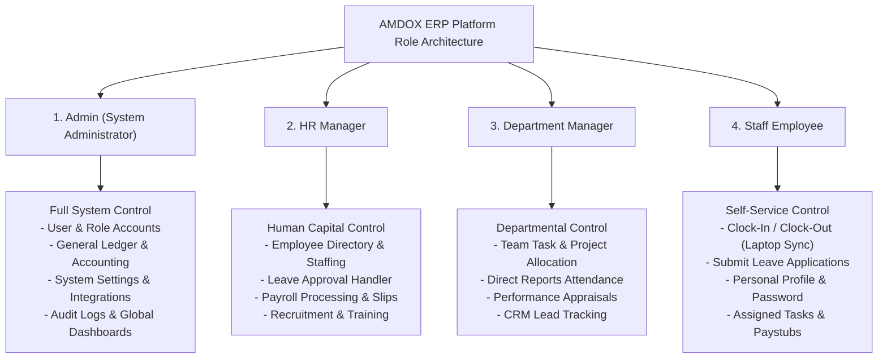
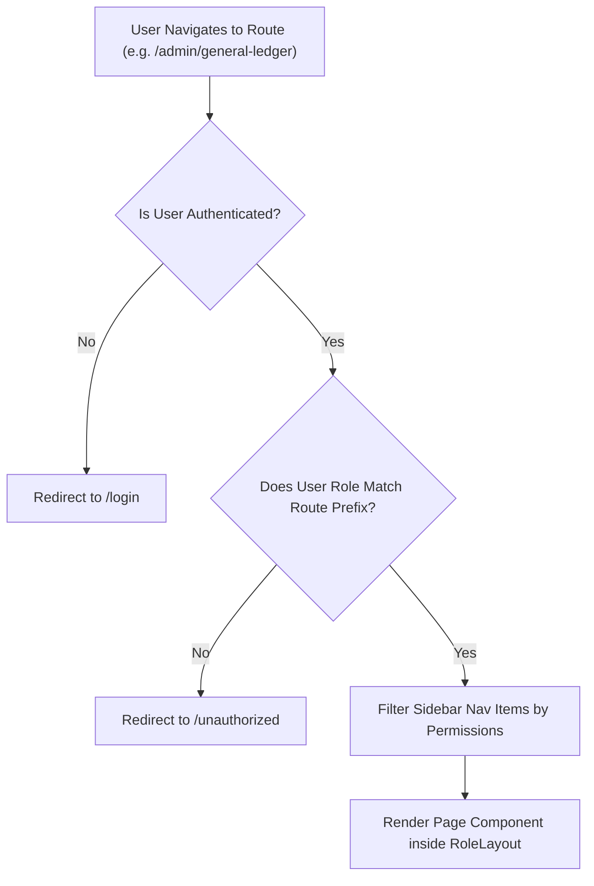

# Role-Based Access Control (RBAC) Architecture

This document documents the Role-Based Access Control (RBAC) model, route protection mechanisms, and permission matrix enforced across **AMDOX ERP**.

## 1. System Role Hierarchy & Inheritance

## 2. Granular Permissions Matrix

| Feature / Module | Admin | HR Manager | Department Manager | Staff Employee |
| :--- | :---: | :---: | :---: | :---: |
| **Manage Users & Role Assignment** | ✅ | ❌ | ❌ | ❌ |
| **General Ledger & Double-Entry Accounting** | ✅ | ❌ | ❌ | ❌ |
| **Accounts Payable & Receivable** | ✅ | ❌ | ❌ | ❌ |
| **System Settings & Payment Gateways** | ✅ | ❌ | ❌ | ❌ |
| **System Audit Logs** | ✅ | ❌ | ❌ | ❌ |
| **Employee Master Directory Management** | ✅ | ✅ | 👁️ (View Only) | 👁️ (Self Only) |
| **Approve / Reject Employee Leaves** | ✅ | ✅ | ✅ (Team Only) | ❌ |
| **Payroll Processing & Slips** | ✅ | ✅ | ❌ | 👁️ (Self Only) |
| **Create & Post Recruitment Job Openings** | ✅ | ✅ | ❌ | ❌ |
| **Create & Assign Tasks / Projects** | ✅ | ✅ | ✅ | ❌ |
| **Manage CRM Sales Leads & Pipeline** | ✅ | ❌ | ✅ | ❌ |
| **Attendance Punch In / Out** | ✅ | ✅ | ✅ | ✅ |
| **Download Paystub Receipts & Invoices** | ✅ | ✅ | ✅ | ✅ |

## 3. Frontend Route Protection Flow (`RoleLayout.jsx`)

