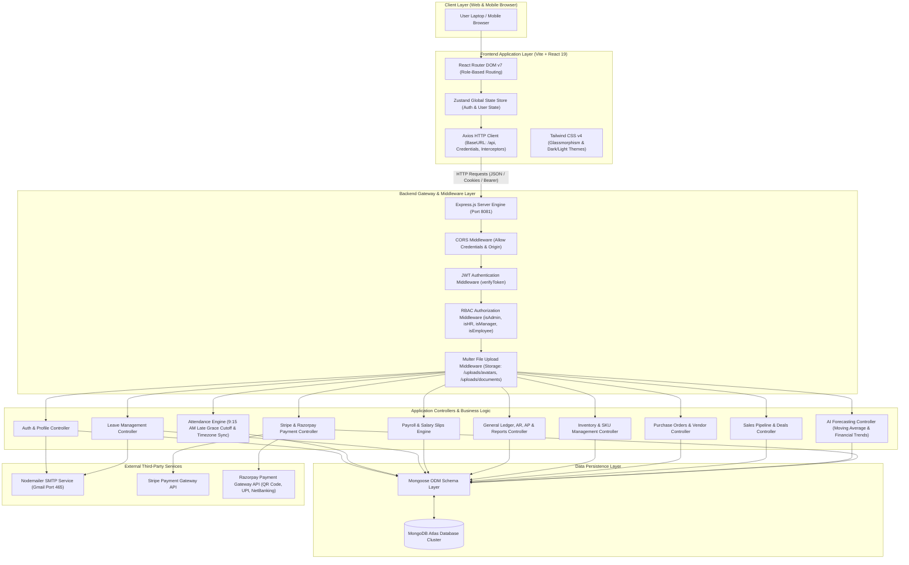

# High-Level System Architecture

This document presents the end-to-end system architecture of the **AMDOX Enterprise Resource Planning (ERP)** platform.

## Architecture Overview

AMDOX ERP is built as a decoupled, multi-tiered enterprise application consisting of a **React 19 single-page application (SPA)** on the frontend, an **Express / Node.js REST API** runtime on the backend, and **MongoDB Atlas** for document persistence.

## Layer Specifications

1. **Client / Presentation Layer**: React 19 single-page application bundled via Vite 6. Utilizes Tailwind CSS v4 for UI rendering and Zustand for persistent authentication state management.
2. **Gateway & Security Layer**: Express.js server utilizing `verifyToken` JWT middleware and RBAC role checkers (`isAdmin`, `isHR`, `isManager`, `isEmployee`).
3. **Controller & Domain Layer**: Modular controller logic handling business rules, including standard 9:15 AM attendance cutoffs, exact minute-to-minute worked hours formatting, double-entry bookkeeping validation, and AI forecasting calculations.
4. **Data Layer**: Mongoose ODM enforcing strict validation schemas over MongoDB document collections.
5. **Integration Layer**: Third-party communication via SMTP (Nodemailer), Stripe Checkout Intent API, and Razorpay QR/UPI Gateway API.
